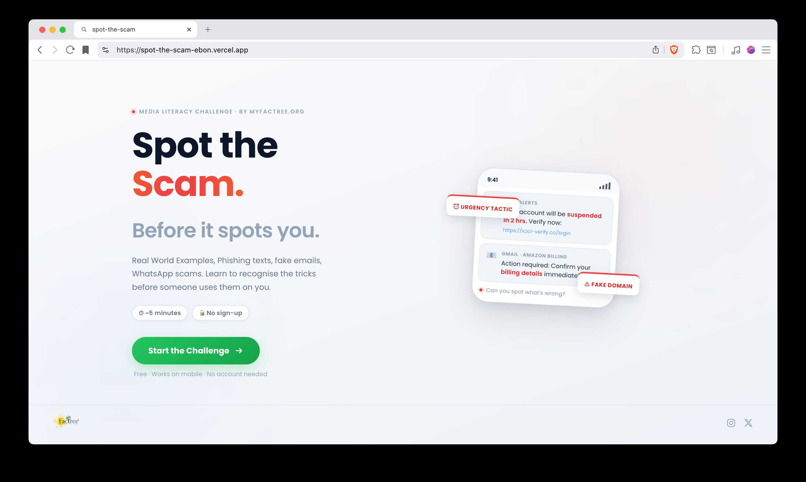

# Spot the Scam

> A media literacy quiz app that teaches people how to identify digital scams through real-world UI simulations, not theory.



[Live](https://myfactree.org/spot-the-scam/) · [Public results](https://myfactree.org/spot-the-scam/impact) · Built for [FactTree](https://myfactree.org)

---

## What is this web app?

Most people learn about scams after they've already fallen for one.

**Spot the Scam** flips that. Instead of reading a list of "tips," you're dropped into a simulated WhatsApp message, Gmail inbox, Instagram DM, or UPI payment screen and asked: _is this real or a scam?_

After you guess, the app walks you through exactly what the red flags were, highlights them directly on the UI, and links you to a FactTree article that goes deeper. It's hands-on, low-stakes practice for something that has very real consequences.

The target audience is anyone who uses a smartphone, as the scam patterns shown are common and can affect users worldwide.

---

## Features

### Simulated Real-World UIs

The app doesn't show screenshots. It renders fully functional, pixel-accurate replicas of:

- WhatsApp (Business account messages)
- Gmail (both plain-text and rich HTML marketing emails)
- SMS (Indian bank and telecom format)
- Instagram DMs
- Browser popups
- Google Pay / UPI collect request screens

Every UI is built in React with CSS that matches the real thing, fonts, colors, layout, icons. The point is that if it looks real, the lesson sticks.

### Interactive Flag System

When you click "Show me →", the app highlights the exact suspicious element inside the UI a spoofed sender address, a fake domain, an urgency phrase and shows a FlagCard explaining _why_ it's a red flag. Multi-flag scams step through each flag one by one.

### Two Modes: the Public Quiz and Workshops

**The public quiz** is ten messages in a row with the red flags after
each, then a score. Nothing more to it.

**A workshop** is reached through a room: the facilitator shows a QR code
or a six-character code, and players join with it. The start screen says
"You're joining: Pune College Workshop" before anything begins. The ten
messages are then split into two rounds of five, drawn so that each holds
the same mix of real and fake. That makes the second half as hard as the
first, so the difference between the two scores is a measurement rather
than luck. Every play is filed under its room, so each workshop gets its
own report.

The mode is decided by the server when it issues the quiz's ticket, not
by anything the browser sends with the result, so a play can't claim to
belong to a workshop it never joined.

### Results Screen

After all 10 questions, you get:

- An SVG ring chart showing your correct/incorrect ratio
- In a workshop, your score in each half and the improvement between them
- How many real scams you trusted, and the kind of message you found hardest (named only when enough questions of that kind were seen to mean anything)
- A per-question review of every answer you gave, each with a line comparing you to other players — "You trusted this one. So did 70% of players." These appear once a question has 50 answers, never say "top 10%", and never claim 0% or 100%
- A shareable summary card
- Direct links to relevant FactTree fact-check articles for each scam

### Admin

`/admin`, behind a login, is where a facilitator runs workshops: create
one, show its QR code (and download it for slides), watch *N joined · N
finished* fill in live, close or extend it, open its report — "Room
KFTR9M · Pune College Workshop — 12 Sept · 23 participants · Average
improvement +26" — and download every answer as a spreadsheet. The full
dashboard across every play lives here too.

Only accounts on the database's admins list see anything. See
`DEPLOY.md` for running a workshop, and `supabase/README.md` for adding
an admin.

### Public Results Page

`/impact` publishes the headline figures anyone can check: quizzes
completed, workshops held, workshop participants, and how much workshop
participants improved, with a plain account of how that is measured. It
never shows a workshop's name or anything about a single play.

It counts **completed plays**, not people. Nothing is stored on a visitor's device, so the app cannot tell a returning player from a new one and does not pretend otherwise.

### Haptic Feedback

On Android, the app uses the `navigator.vibrate` API to give physical feedback when you pick an answer a double pulse for phishing, a single buzz for legitimate. Small details gives you big feel.

### Mobile Responsive

The entire app is designed mobile-first. The simulated phone UIs scale correctly on small screens, the FlagCard repositions relative to the flagged element, and the page auto-scrolls to keep the card in view. So **the user doesn’t have to scroll down to reach the buttons.**

### Progress Bar

A live progress bar at the top of the quiz tracks where you are in the 10 question set.

---

## Tech Stack

| Layer     | Tech                                                                           |
| --------- | ------------------------------------------------------------------------------ |
| Framework | React 19 (Vite 7)                                                              |
| Styling   | Plain CSS with custom properties (no UI library)                               |
| State     | React hooks only (`useState`, `useEffect`, `useRef`, `useCallback`, `useMemo`) |
| Routing   | Path check for `/impact`; the quiz is a state machine                          |
| Data      | Static JS module (`scams.js`); results in Supabase                             |
| Backend   | One Supabase Edge Function (Deno) — the only thing allowed to write            |
| Icons     | Phosphor, on the impact and admin pages only, in their own bundles             |
| QR codes  | uqr (zero dependencies), on the admin page only                                |
| Fonts     | Poppins via Google Fonts                                                       |
| Tests     | Vitest, run on every push by GitHub Actions                                    |
| Build     | Vite                                                                           |

The quiz itself is fully static and deployable to any host. Results are
sent to a Supabase Edge Function, which scores them and stores them
anonymously; the app works perfectly with none of that configured.

The quiz itself needs nothing beyond React. The Supabase client library
was dropped in favour of plain `fetch` — 58KB gzipped is a real cost on
a rural connection, and the app makes a handful of simple requests. The
admin login is plain `fetch` too. The icon set and the QR code library
ship only to `/impact` and `/admin`, which are code-split, so a player
answering ten questions never downloads them.

See `DEPLOY.md` for hosting, `supabase/functions/README.md` for the
result-collection setup, and `tests/README.md` for what the tests
cover.

---

## Architecture

```
src/
├── App.jsx                  # Root. picks the quiz, /impact or /admin; holds the workshop room
├── App.css                  # Global tokens, animations, ScamScreen and FlagCard styles
├── scams.js                 # All 10 scam definitions (message data + flags + anchors + articles)
├── StartScreen.jsx          # Landing page, with the workshop join
├── ScamScreen.jsx           # Core quiz logic. phase state machine, both modes
├── ResultsScreen.jsx        # Results, comparison lines, workshop save status
├── PublicImpact.jsx         # Public headline figures at /impact (its own bundle)
├── NameScreen.jsx           # Optional first name, used inside the scams
├── session.js               # Question order per mode, scoring, before/after
├── identity.js              # Name handling, never stored
├── hooks/
│   └── useFlagCardPosition.js  # Where the explanation card goes, and scrolling
├── lib/
│   ├── route.js             # Which page a URL is
│   ├── room.js              # Workshop codes, links, and checking a code
│   ├── ticket.js            # One-time ticket, requested when a run starts
│   ├── saveSession.js       # Posts a finished play; retries a dropped connection
│   ├── questionStats.js     # How every player did on each question
│   ├── comparisons.js       # The "70% of players…" lines, and their honesty rules
│   ├── supabase.js          # Public-key requests, with one retry for a waking server
│   ├── format.js            # Numbers and dates, shared by both impact pages
│   └── htmlToText.js        # Decodes feed titles instead of injecting HTML
├── components/
│   ├── FlagCard.jsx         # Floating explanation card
│   ├── flagAnchor.js        # Pairs a flag with the element it points at
│   ├── WorkshopJoin.jsx     # "You're joining…", ended rooms, typing a code
│   ├── ImpactPanel.jsx      # A workshop's before and after
│   ├── Stats.jsx            # Scams trusted, biggest blind spot
│   ├── ShareCard.jsx        # Shareable result image
│   └── …Scam.jsx            # The six simulated screens
└── admin/                   # /admin only — a separate download players never get
    ├── AdminApp.jsx         # Login gate and tabs
    ├── auth.js              # Email + password login, this tab only
    ├── api.js               # Reads and writes with the admin's own login
    ├── RoomsScreen.jsx      # Workshops: create, live counts, close, extend, delete
    ├── RoomReport.jsx       # One workshop's results and spreadsheet
    ├── SharePanel.jsx       # QR code, code and link for the screen
    ├── QrCode.jsx           # QR drawn as SVG squares
    ├── csv.js               # Spreadsheet export
    └── ImpactDashboard.jsx  # The full dashboard across every play

supabase/                    # SQL migrations + the submit-session Edge Function
tests/                       # Vitest suite, run on every push by GitHub Actions
```

### How the quiz state machine works

`ScamScreen` manages a `phase` variable that moves through four states:

```
idle → verdict-chosen → revealing → [next scam or analytics]
```

- `idle` — Scam is displayed, Phishing/Legitimate buttons are visible
- `verdict-chosen` — User has picked, "Show me →" button appears
- `revealing` — FlagCard is shown, flags step through one by one
- After the last flag of the last scam → `ResultsScreen`

### How FlagCard positioning works

Every screen marks the element a flag points at with `data-flag-anchor="<flag id>"`. `useFlagCardPosition` looks that exact element up and places the card 12px below it, the way the Jigsaw phishing quiz does. The card may cover the message beneath it, and that is fine: people read the message before they answer, so the reveal is about one phrase at a time.

Two details keep it honest:

- The lookup is by flag id and scoped to the message. It used to search for anything carrying `.active`, which the card's own progress dots also use — so when a message had nothing highlighted, the card found its own dot and positioned itself against itself.
- A phrase near the edge of the screen would drag the card half out of view. The card stops at the edge instead and slides its arrow along its top edge to stay under the phrase.

If the card overflows the phone UI's natural height, `paddingBottom` is added to the container to make room. A second pass watching `containerPad` scrolls the card into view only after that extra room is really in the DOM, so the scroll target is measured against the final height.

Screens never name a flag in their JSX. Where a flag has no phrase to attach to — the UPI request has no message text, the Netflix email renders artwork — the pairing lives in `scams.js` as an `anchors` map from flag id to a slot the screen provides. A test fails if a screen mentions a flag id at all.

---

## Scam Coverage

| #   | Platform      | Type                        | Verdict    |
| --- | ------------- | --------------------------- | ---------- |
| 1   | SMS           | ICICI bank phishing         | Phishing   |
| 2   | SMS           | SBI OTP (real transaction)  | Legitimate |
| 3   | Email         | Amazon billing scam         | Phishing   |
| 4   | Email         | Netflix marketing email     | Legitimate |
| 5   | WhatsApp      | Jio KYC scam                | Phishing   |
| 6   | WhatsApp      | Swiggy order confirmation   | Legitimate |
| 7   | Instagram     | Fake brand collaboration DM | Phishing   |
| 8   | Browser Popup | Fake virus alert            | Phishing   |
| 9   | Email         | FactTree newsletter         | Legitimate |
| 10  | UPI           | Collect request scam (GPay) | Phishing   |

Each scam is tied to a [FactTree](https://myfactree.org) article so users can read the real investigative context behind it.

---

## Why it matters

India had over 1.1 million cybercrime complaints in 2023. A significant portion of them UPI fraud, phishing, fake KYC prey on people who simply haven't seen these patterns before.

<!-- Reading a blog post about "how to spot phishing" is easy to forget. *Almost falling for something* is not. This app creates that near-miss experience in a safe environment. -->

The goal isn't to make people paranoid it's to build pattern recognition so that when a real scam lands in their inbox, something feels off before they act.

It's also built to be embeddable in digital literacy workshops, school curricula, and journalism training anywhere people need practical, low-barrier media literacy education.

---

## How results are collected

Nothing about a player is stored. No name, no email, no device id, no
cookie. A finished play is a row of answers and timings, and that is all.

Browsers cannot write to the database. They used to, which meant a short
script could have filled the public figures with invented plays. Results
now go to a Supabase Edge Function that:

1. Issues a one-time ticket when a quiz starts, and accepts it once
2. Refuses anything submitted impossibly fast
3. Limits how many results can arrive from one place in an hour
4. Marks every answer against its own copy of the answer key, and works
   out the score itself

That last point is the important one: the browser is never asked what it
scored, so it cannot misreport it. The public key shipped in the
JavaScript grants no read, insert, update or delete on any table.

A determined attacker could still get through. What changed is that
spoiling the figures is real work for no reward rather than one line of
code.

See `supabase/functions/README.md` for the setup.

---

## Running locally

```bash
git clone https://github.com/lemoonrick/spot-the-scam.git
cd spot-the-scam
npm install
npm run dev
```

Requires Node 18+.

**The quiz runs with no configuration.** Without a `.env` it simply does
not save results; everything a player sees still works. To collect
results, copy `.env.example` to `.env` and fill in the two Supabase
values. `.env` is git-ignored and must never be committed.

```bash
npm run dev      # local development
npm test         # the test suite
npm run lint     # code checks
npm run build    # production files, into dist/
```

Lint, tests and build run automatically on every push via GitHub
Actions.

---

## Built by

[Hrithik](https://github.com/lemoonrick) — Web developer, and media literacy nerd at [FactTree](https://myfactree.org).

---

## License

MIT
